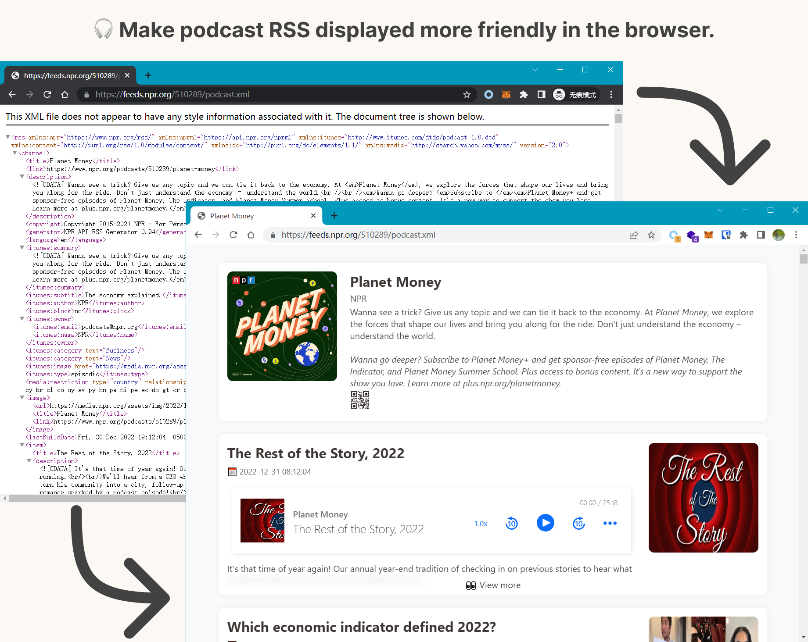

# Nice Podcast RSS

  

A browser extension that makes podcast RSS displayed more friendly.

# Screenshot

# Installation

- Install from [Chrome Web Store](https://chrome.google.com/webstore/detail/ofofpfeldepmeolpbcmehmfgakjnlekf):

  

- Install from [Microsoft Edge Addons](https://microsoftedge.microsoft.com/addons/detail/nice-podcast-rss/jiajdakidkmamepkdaclhefhfjnikhpc):

  

# Supported Platforms

| Platform       | URL Pattern                                                  |
| -------------- | ------------------------------------------------------------ |
| Anchor         | `anchor.fm/s/*/podcast/rss`                                  |
| Fireside       | `feeds.fireside.fm/*/rss`                                    |
| Buzzsprout     | `feeds.buzzsprout.com/*.rss`                                 |
| Typlog         | `*.typlog.io/feed/audio.xml`                                 |
| Libsyn         | `*.libsyn.com/rss` `feeds.libsyn.com/*/rss`             |
| Acast          | `feeds.acast.com/public/shows/*`                             |
| Megaphone      | `feeds.megaphone.fm/*`                                       |
| Simplecast     | `feeds.simplecast.com/*`                                     |
| RSS.com        | `media.rss.com/*/feed.xml`                                   |
| Podbean        | `feed.podbean.com/*/feed.xml`                                |
| Sounder.fm     | `feeds.sounder.fm/*/rss.xml`                                 |
| SoundOn        | `feeds.soundon.fm/podcasts/*.xml`                            |
| NPR            | `feeds.npr.org/*/podcast.xml`                                |
| ART19          | `rss.art19.com/*`                                            |
| Omny Studio    | `omnycontent.com/d/playlist/*/podcast.rss` `*.omnycontent.com/d/playlist/*/podcast.rss` |
| RedCircle      | `feeds.redcircle.com/*`                                      |
| JustPod Media  | `justpodmedia.com/rss/*.xml`                                 |
| Xiaoyuzhou FM  | `feed.xyzfm.space/*`                                         |
| Ximalaya       | `*.ximalaya.com/album/*.xml`                                 |
| Lizhi FM       | `rss.lizhi.fm/rss/*.xml`                                     |
| Wav Pub        | `*.proxy.wavpub.com/*.xml`                                   |
| Qingting FM    | `papi.qingting.fm/podcast/channels/*`                        |
| VISTOPIA       | `api.vistopia.com.cn/rss/program/*.xml`                      |
| Get Podcast    | `getpodcast.xyz/data/*.xml`                                  |
| Pod API        | `host.podapi.xyz/*/feed.rss`                                 |
| Tangsuan Radio | `feed.tangsuanradio.com/*.xml`                               |
| Casted         | `feeds.casted.us/*/feed`                                     |

# Acknowledgements

- [https://github.com/jessuni/shikwasa](https://github.com/jessuni/shikwasa)
- [https://github.com/iamkun/dayjs](https://github.com/iamkun/dayjs)
- [https://github.com/davidshimjs/qrcodejs](https://github.com/davidshimjs/qrcodejs)

# License

MIT License